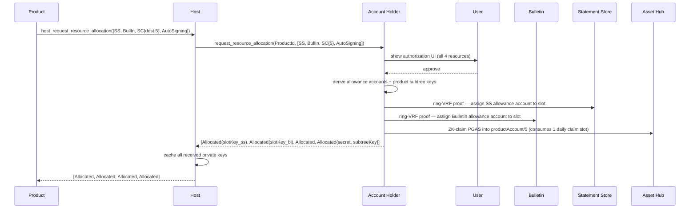
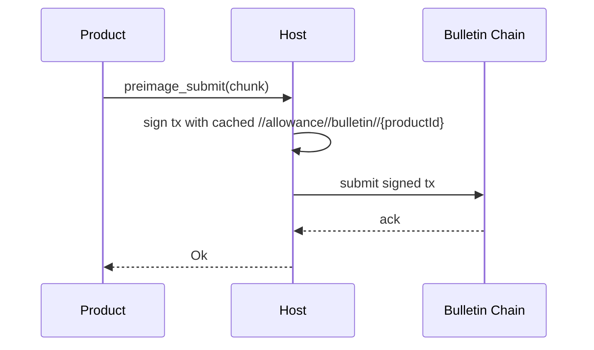
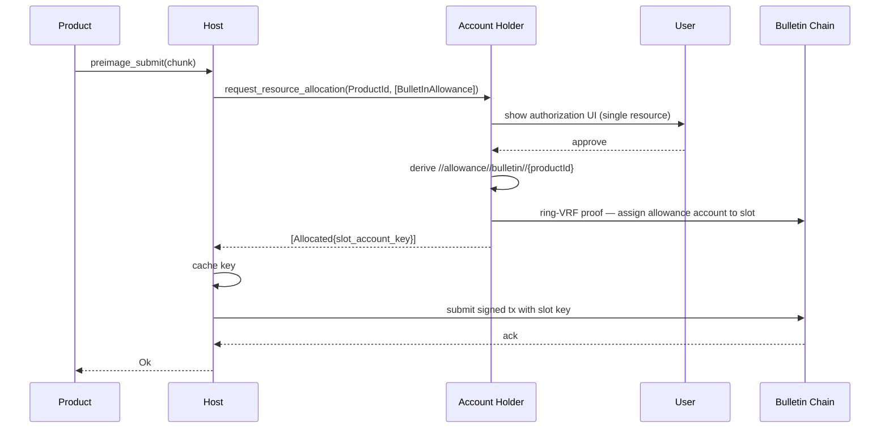
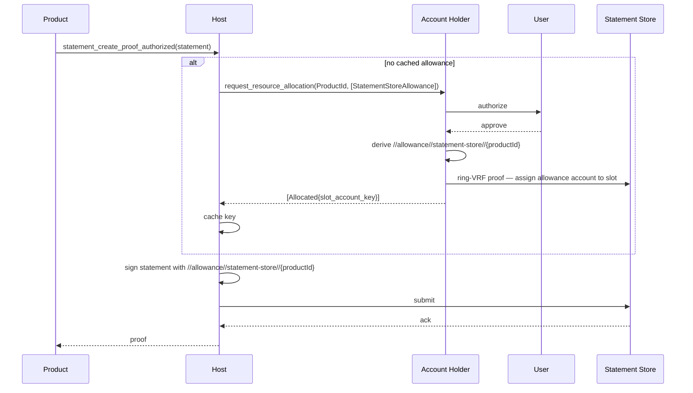
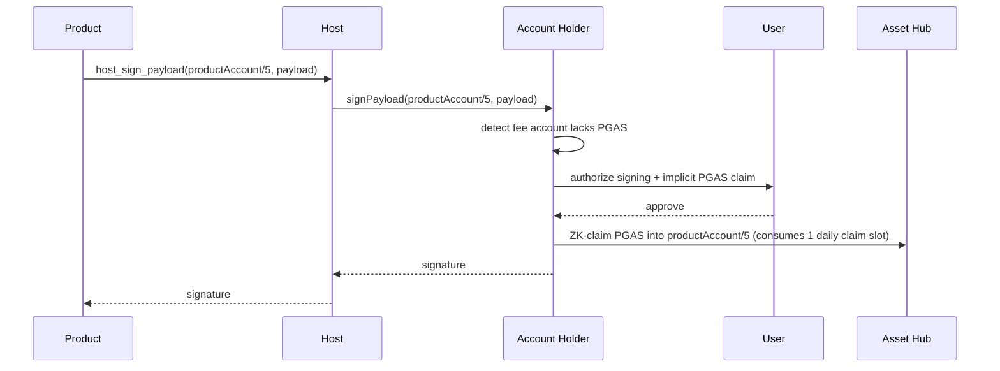
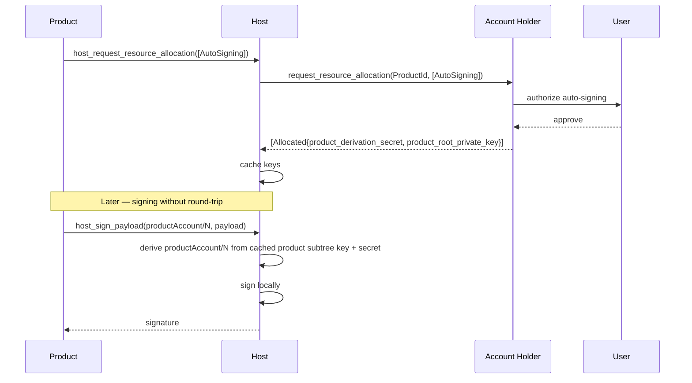

# RFC-0010: W3S Allowance Management in TrUAPI

|                 |                                                                                           |
| --------------- | ----------------------------------------------------------------------------------------- |
| **RFC Number**  | 10                                                                                        |
| **Start Date**  | 2026-04-14                                                                                |
| **Description** | TrUAPI calls and Accounts Protocol companion for granting products access to Bulletin, Statement Store, and Smart Contract allowances |
| **Authors**     | Valentin Sergeev                                                                          |

## Summary

Products running on a Polkadot Host need to submit data to three allowance-gated systems — the Bulletin chain, the Statement Store, and Asset Hub smart contracts — each of which grants free-to-use resources to users but requires the signing origin to hold the appropriate allowance. This RFC defines how products obtain and use those allowances via TrUAPI without managing the underlying slot-table state themselves, by introducing a single pre-allocation call (`host_request_resource_allocation`) and a companion Accounts Protocol request used by the Host to negotiate private-key material with the Account Holder.

## Motivation

Three systems in the Polkadot ecosystem grant sponsored access via per-user quotas:

| System | Mechanism | Persistence |
|---|---|---|
| Bulletin | Slot table, N slots assigned via ring-VRF proof, 2-week expiry + 2-week grace | Data deletable after grace |
| Statement Store (SSS) | Slot table, same mechanism as Bulletin | Non-persistent; expiry irrelevant |
| Smart Contract (SC) | PGAS token claimed anonymously via ZK proof of (lite-)personhood ring; burned on AH fee payment | Daily per-user claim budget; balance accumulates per claim, drained per tx |

The common thread: users hold the entitlement, but the signing origin on the wire must hold the allowance. Products — running in a sandbox and never entrusted with private-key material — cannot manage ring-VRF proofs, slot assignment, or per-product ring membership themselves. Without a standardized path:

- Products cannot submit to Bulletin today — the previous `preimage_submit` host call was removed because it offered no per-product renewal control, and no replacement exists.
- Products cannot submit to SSS independently; `statement_create_proof` today requires owning a product account that already holds an allowance.
- Products cannot pay SC fees without the Account Holder performing an implicit top-up at signing time.

Requirements for a solution:

1. **Products never receive private-key material.** The user's root private key never leaves the Account Holder; product and allowance private keys, when materialized at all, are cached on the Host under explicit user authorization and never exposed across the TrUAPI boundary.
2. **Grants are independent.** Granting Bulletin allowance must not leak SS allowance or product signing keys, and vice versa.
3. **Cross-product unlinkability.** An observer who obtains a single product's account and inspects its on-chain / off-chain traffic must not be able to link that activity to any other product the same user runs. Allowance-bearing origins must be partitioned per product.
4. **One round-trip to the Account Holder per user authorization.** Products need a way to pre-allocate the resources they will use, eliminating repeated authorization UI during a session.
5. **Minimal API surface.** Existing calls (`preimage_submit`, `statement_create_proof_authorized`) keep their signatures — allowance is entirely the Host's concern.

## Stakeholders

- **Host developers** — implement the Accounts Protocol client, cache allowance private keys received from the Account Holder, and use them to sign Bulletin / SSS submissions on the product's behalf.
- **Account Holder developers (Mobile App)** — own the slot-table bookkeeping (allowance account derivation, ring-VRF slot assignment, automatic renewal of expiring slots), the authorization UI, key sharing with the Host, and implicit PGAS claim for SC fee payment.
- **Product developers** — consume `host_request_resource_allocation` and the unchanged submission APIs.
- **Novasama Technologies / Parity product teams** — own the reference integrations that this RFC unblocks.

This RFC is based on the direction and decisions reached by the Host ↔ Product working group on 2026-04-14. See [SC allowance doc](https://docs.google.com/document/d/10JtVUoZcw_sqEhnZKtlIxk9menvkOEJQZWhvj8IMfeo/edit) for the SC-specific context.

## Explanation

### Terminology

- **ProductId** — opaque identifier for a product (e.g. its dotNS identifier). The Host always knows the calling product's id and forwards it to the Account Holder on Accounts Protocol calls that require authorization to be scoped to a specific product.
- **Product account** — account derived under a product's hierarchy `/{productId ++ perProductDerivationSecret}/{index ++ indexDerivationSecret}`. Uses soft derivation with secret components per layer, rooted at the user's root key.
- **Allowance account** — dedicated hard-derived account `//allowance//{system}//{productId}` used solely to hold slot-table allowance for a given product and system (Bulletin or SSS). Hard-derived from the **user's root key**, not from the product subtree.
- **Account Holder** — component that exclusively holds the user's root **private** key and authorizes resource grants. Typically the Mobile App. During the Accounts Protocol handshake it shares the user's root **public** key with the Host; the Host then derives product account public keys locally via soft derivation (with caveats around secret derivation components). Product account *private* keys are never on the Host unless AutoSigning is explicitly granted; in that case the Account Holder transfers the product subtree private key so the Host can sign locally. Allowance account private keys are similarly transferred only for explicitly granted Bulletin / SSS allowance.
- **AutoSigning** — a capability a product can request that transfers the product's subtree private key (`/{productId ++ productDerivationSecret}`) from the Account Holder to the Host. Once granted, the Host can sign from any account in that product's subtree without round-tripping to the Account Holder. Orthogonal to slot-table allowances (see §Design decisions for why the two are nonetheless linked in the account-partitioning decision).
- **Host** — component running products and exposing TrUAPI. Communicates with the Account Holder via the Accounts Protocol.
- **Accounts Protocol** — Host ↔ Account Holder channel used to request user-authorized operations (including private-key sharing for allowance accounts and AutoSigning). Runs over Statement Store today; larger-payload transports (Web3RTC DataChannels, HOP) are future improvements and out of scope for this RFC. Relevant message shapes are defined inline below. Note: *SSO* in this project refers specifically to the handshake portion of the Accounts Protocol (QR-code pairing), not to the protocol as a whole.

### Bulletin allowance

- The TrUAPI call `preimage_submit` is retained with its existing signature; the product is not concerned with how allowance is provisioned.
- Each product receives a dedicated allowance account derived as `//allowance//bulletin//{productId}`.
- The Account Holder shares the private key of that account with the Host via the Accounts Protocol once the user approves.
- On the first `preimage_submit` call — or when existing allowance is exhausted — the Host opportunistically requests allocation from the Account Holder (see "Implicit allocation" below).
- The slot table itself lives on People chain and propagates allowance grants to Bulletin via XCM. See [paritytech/individuality#785](https://github.com/paritytech/individuality/pull/785) for the chain-side design.

### Statement Store allowance

- New TrUAPI call `statement_create_proof_authorized(Statement)` is added. It takes only a `Statement` — **no** `ProductAccountId`. The semantics is "sign this statement using any account that holds SSS allowance"; the Host picks the allowance-bearing account internally (in practice, the product's own allowance account `//allowance//statement-store//{productId}`).
- Each product receives a dedicated allowance account derived as `//allowance//statement-store//{productId}`.
- The Account Holder shares the private key with the Host via the Accounts Protocol.
- On first use or allowance exhaustion, the Host requests allocation implicitly.

### Smart contract allowance

- SC allowance is provided via **PGAS** (People Gas), a sufficient asset on Asset Hub that can pay AH execution fees and `pallet-revive` storage deposits. PGAS is claimed anonymously via a ZK proof of (lite-)personhood from the same ring used for PoP — no separate sponsorship ring is introduced — into an account of the claimant's choice. Each (lite-)person has a daily claim budget (placeholder: 100 claims/day for full personhood, 10/day for lite). See *Free transactions for PoP users* (Prior Art) for the chain-side mechanism and the trade-offs.
- No new TrUAPI call is required. SC allowance does **not** use a separate allowance account — Asset Hub transactions originate from the product account directly. During `host_sign_payload` / `host_create_transaction` for **any** Asset Hub transaction signed with a product account, the Account Holder implicitly claims one slot's worth of PGAS into that product account when it is about to pay fees and does not hold enough PGAS. This is not SC-specific — it applies to every AH tx from a product account, since PGAS is the universal fee-payment asset.
- Products that want to eliminate the implicit-claim latency from the signing hot path can **optionally** pre-warm a specific product account by requesting `SmartContractAllowance { dest }` via `host_request_resource_allocation` — this triggers the PGAS claim up-front so later signing requires no top-up round-trip. Pre-warming is the only reason SC appears in `AllocatableResource`; the steady-state signing flow works without it.
- The previously proposed `account_get_sponsorship_member_key` is **not** added. The PGAS claim uses the same (lite-)person ring that PoP uses, so no per-product sponsorship-ring member key is needed.

### Pre-allocation: `host_request_resource_allocation`

Products can pre-allocate resources to eliminate round-trips on later submission calls. A single TrUAPI call covers all resource kinds:

```rust
enum AllocatableResource {
    /// Allocate slot in SSS slot table
    StatementStoreAllowance,
    /// Allocate slot in Bulletin slot table
    BulletInAllowance,
    /// Pre-claim PGAS into product account at `dest` to cover AH fees / storage deposits
    SmartContractAllowance { dest: DerivationIndex },
    /// Grant auto-signing from product's own accounts.
    /// Transfers the product subtree private key from Account Holder to Host,
    /// letting the Host sign locally without round-trips. See
    /// `ApAllocatedResource::AutoSigning` below for the exact shape of the
    /// transferred material.
    AutoSigning,
}

enum AllocationOutcome {
    Allocated,
    Rejected,     // user declined authorization for this specific resource
    NotAvailable, // host or underlying system cannot currently grant this resource
                  // (e.g. SC allowance requested but the user's daily PGAS claim budget is exhausted,
                  // or a transient capacity issue the user did not cause)
}

fn host_request_resource_allocation(
    resources: Vec<AllocatableResource>
) -> Vec<AllocationOutcome>;
```

**Return contract.** The returned `Vec<AllocationOutcome>` matches the request in length and order: `result[i]` is the outcome for `resources[i]`. Products never see private-key material; keys stay on the Host. Each entry is **independent**: an `Allocated` result means that specific resource was successfully granted and is usable, regardless of whether sibling entries in the same call returned `Rejected` or `NotAvailable`. There is no rollback of partially successful allocations.

**Pre-allocation is opt-in, not eager.** Calling `host_request_resource_allocation` is strictly optional — every submission API works without it via implicit allocation on first use. The pre-allocation call exists purely to eliminate Account Holder round-trips from the steady state. Hosts must not pre-allocate every resource on every product's startup on the product's behalf: eager over-allocation would fragment the user's Bulletin and SSS slot tables with assignments to resources the product never uses, blocking other products from obtaining those resources without user intervention. Products opt in to only the resources they know they will need.

**Repeat calls (on-demand scaling).** Invoking `host_request_resource_allocation` again for a previously granted slot-table resource returns the **same** `slot_account_key` (identity preserved) and additionally assigns that account to one more slot in the table. The first successful call yields one slot's worth of base allowance; each additional successful call adds another slot. The product accumulates allowance linearly at the cost of linearly consuming slots. This mechanism is for scaling allowance beyond the default, not for renewal.

**Renewal is not a product concern.** Bulletin slots expire after 2 weeks (+ 2-week grace). Keeping an existing allowance alive across expiry is handled automatically by the Account Holder — it reassigns the same allowance account to a fresh slot before the old one expires, without product or Host involvement. Products do not need to call `host_request_resource_allocation` periodically to stay funded.

**Slot-table saturation.** Each user has a fixed number of Bulletin and SSS slots. When a new allocation is requested but all of the user's slots are already occupied, the Account Holder's authorization UI surfaces the conflict and asks the user to select which existing slot(s) to evict in favor of the new one. The user-facing resolution — including which products and which systems have existing claims — is part of the Account Holder's resource-allocation confirmation UX and not a TrUAPI concern. `NotAvailable` is therefore reserved for cases where the resource simply cannot be granted (e.g. the user declined to evict anything), not for a raw "table full" signal to the product.

### Accounts Protocol companion

When the Host needs to provision an allocation with the Account Holder, it issues the following request:

```rust
struct ResourceAllocationRequest {
    calling_product: ProductId,
    resources: Vec<ApAllocatableResource>,
    on_existing: OnExistingAllowancePolicy,
}

enum ApAllocatableResource {
    StatementStoreAllowance,
    BulletInAllowance,
    SmartContractAllowance { dest: DerivationIndex },
    AutoSigning,
}

/// Behavior when the requested resource already has an active allocation
/// for this (user, product) pair on the Account Holder side.
enum OnExistingAllowancePolicy {
    /// If an allocation already exists, return the existing keys and allowance
    /// without further slot assignment. If no allocation exists, the Account
    /// Holder performs a normal first-time allocation (one slot) and returns
    /// the new keys. Used by a Host that may be either bootstrapping or
    /// syncing state from another Host — it does not need to know which.
    Ignore,
    /// Always assign one additional slot to the same allowance account.
    /// Used when the Host is deliberately scaling up an allocation it has
    /// previously cached.
    Increase,
}

enum ApAllocationOutcome {
    Allocated(ApAllocatedResource),
    Rejected,
    NotAvailable,
}

enum ApAllocatedResource {
    StatementStoreAllowance { slot_account_key: PrivateKey },
    BulletInAllowance { slot_account_key: PrivateKey },
    SmartContractAllowance,
    AutoSigning {
        /// Secret component of the soft-derivation path.
        /// Used to derive per-product accounts via
        /// `/{derivationIndex ++ derivationIndexSecret}`,
        /// where `derivationIndexSecret = hash(productDerivationSecret, index)`.
        product_derivation_secret: String,
        /// Private key of `/{productId ++ productDerivationSecret}`.
        product_root_private_key: PrivateKey,
    },
}

/// The returned vec matches `resources` in length and order.
fn request_resource_allocation(
    resources: Vec<ApAllocatableResource>
) -> Vec<ApAllocationOutcome>;
```

`AllocatableResource` and `ApAllocatableResource` are **distinct types** — one crosses the TrUAPI boundary (Product ↔ Host), the other crosses the Accounts Protocol boundary (Host ↔ Account Holder). Their shapes happen to align today, but each evolves on its own schedule.

**How the Host picks `OnExistingAllowancePolicy`.** The policy is a Host-internal decision, not a product concern; TrUAPI itself exposes no equivalent knob:

- If the Host holds no cached keys for `(product, resource)`, it sends `Ignore`. This covers both the genuine first-time case and the case where a second Host joins a user's session — the Host does not need to distinguish them, because `Ignore` collapses both paths on the Account Holder side (allocate-if-missing, return-existing-otherwise).
- If the Host already holds cached keys and the product calls `host_request_resource_allocation` again for the same resource, the Host sends `Increase`. This is the additive scaling path: the same allowance account is assigned to an additional slot.

**Concurrency.** The Account Holder serializes `request_resource_allocation` calls per `(user, product, resource)` tuple. Two Hosts both sending `Ignore` concurrently against the same product, with no prior allocation, are processed sequentially: the first allocates one slot and returns the keys; the second sees an existing allocation and returns the same keys with no additional slot consumed. There is no double-allocation race.

This keeps the product-facing contract simple ("call again to get more allowance") while letting multiple Hosts for the same user share allowance state without inadvertently inflating it.

### Implicit allocation

If a product calls `preimage_submit` or `statement_create_proof_authorized` without having pre-allocated — or if previously allocated allowance is exhausted — the Host issues an Accounts Protocol `request_resource_allocation` for the single required resource. Policy choice follows the same rule as for explicit pre-allocation: `Ignore` if no cached keys exist (first-time or fresh-Host case), `Increase` if cached keys exist but allowance has been depleted.

- **Blocking.** The TrUAPI call blocks until the Account Holder responds. The Host cannot submit to Bulletin / SSS without the slot account key.
- **UI.** The Account Holder presents the same authorization surface as for pre-allocation, but listing a single resource. Repeated prompts on active products are the motivation for offering pre-allocation.

### Flows

#### Pre-allocation (all resources in one call)



#### Bulletin submission — pre-allocated



#### Bulletin submission — implicit allocation



#### Statement Store submission



#### Smart contract fee payment (implicit top-up)



Pre-allocating `SmartContractAllowance { dest: 5 }` eliminates the claim step on the signing path — the PGAS is already in place.

#### Auto-signing



### Design decisions

**Dedicated allowance accounts rather than product accounts (Bulletin / SSS only).** Bulletin and SSS use separate `//allowance//{system}//{productId}` accounts; SC and other Asset Hub transactions do not — they sign from the product account directly and rely on implicit PGAS claim into that account. Two reasons drove the Bulletin / SSS choice:

1. **Soft-derivation overhead.** Product accounts are soft-derived with secret components at every layer; reusing them for allowance would pull those secrets into the grant path where they serve no purpose — the Account Holder would share the allowance private key with the Host anyway.
2. **Independence from AutoSigning.** If Bulletin / SSS allowance were granted directly to product accounts, granting the allowance would require transferring the product's private key to the Host — which is exactly what AutoSigning does. The two grants would be inseparable: a user approving "let this product submit to Bulletin" would implicitly also approve "let this product sign any transaction as me." Keeping allowance on separate hard-derived accounts means Bulletin / SSS allowance and AutoSigning are independent capabilities that the user grants (or denies) separately, even though the mechanisms themselves are orthogonal.

**Slot reassignment over key rotation.** Whether scaling allowance (repeated `host_request_resource_allocation` calls) or renewing an expiring slot (automatic, Account-Holder-driven), the same allowance account is assigned to an additional / fresh slot rather than rotated to a new account. This keeps the Host's cached key valid across the account's full lifetime and avoids invalidating in-flight submissions.

**No product or Host control over which slot.** Slot selection is entirely the Account Holder's concern — it owns the slot table and performs the ring-VRF assignment. Neither products nor Hosts address individual slots or can cause a specific slot to be released.

## Drawbacks

- **Slot-table pressure.** In a session where many products each request pre-allocation, the Bulletin and SSS slot tables fill at the rate of one slot per (product, system). Steady state does not grow over time: each 2-week period the Account Holder reassigns the allowance account into fresh slots, replacing expired ones rather than accumulating. Additional slots are only consumed when a product explicitly calls `host_request_resource_allocation` again to scale its allowance. Alternatives that pooled slots at the host-session level were rejected on independent-control grounds; this per-product footprint is the accepted cost.
- **Implicit-allocation latency.** When a product submits without pre-allocating, the first call blocks on a full Host → Account Holder → user-UI round-trip. For chatty products this is user-visible UI churn; pre-allocation is the mitigation but requires product-side discipline.
- **AutoSigning widens the trust boundary.** Granting AutoSigning transfers the product's subtree private key (root of `/{productId ++ productDerivationSecret}`) from the Account Holder to the Host. The user's root private key is unaffected and still never leaves the Account Holder, but the Host becomes a persistent custodian of the product subtree key, with all the custody obligations that implies. Products and Hosts must treat AutoSigning as a qualitatively different grant from the slot-table allowances.
- **No revocation in v1.** Once granted, allowance keys and AutoSigning material remain on the Host until the product is uninstalled or (future work) an explicit revocation flow exists. There is no user-facing "kick this product out" control in this RFC.

## Testing, Security, and Privacy

**Security.**

- Products never receive any private-key material. The user's root private key stays on the Account Holder. Allowance and product subtree keys, when cached on the Host, are used on the product's behalf but never crossed back over the TrUAPI boundary.
- Allowance keys are scoped: the `//allowance//bulletin//{productId}` path ensures a compromised product cannot impersonate another product's allowance even if the Host mishandles storage.
- AutoSigning is the one grant that widens the Host's trust surface. The Account Holder must surface this distinctly in the authorization UI so users can differentiate "let this product submit statements" from "let this product sign arbitrary transactions as me."

**Threat model.** The Host is **trusted** in this design — it caches user-authorized private keys and signs on the product's behalf. The Accounts Protocol channel between Host and Account Holder is **encrypted end-to-end**; an adversary on the wire between those two components sees neither `calling_product` nor the allocated key material. The threat boundary this RFC defends against is an **on-chain / off-chain data-plane observer** (anyone indexing Bulletin, SSS, or Asset Hub) plus a compromised product. It does *not* defend against a compromised Host or Account Holder.

**Privacy.** Cross-product unlinkability within the stated threat model is a primary design requirement and is upheld by the dedicated per-product allowance accounts. Each product's Bulletin / SSS submissions originate from `//allowance//{system}//{productId}`, a path hard-derived from the user's root and containing no material shared across products. An observer who obtains one product's allowance account — or even its full traffic history — cannot correlate it to any other product used by the same user: the allowance accounts are independent hard derivations, and SC fee payments land in distinct per-product accounts. Pooled or host-session-wide allowance schemes were rejected for this reason.

## Performance, Ergonomics, and Compatibility

### Performance

Pre-allocation eliminates Host ↔ Account Holder round-trips from the submission hot path. A well-behaved product that calls `host_request_resource_allocation` at startup incurs one authorization dialog and subsequently submits to Bulletin / SSS / SC without any cross-process UI. A product that skips pre-allocation incurs a full round-trip on every first-use and every exhaustion event, but is never worse than one dialog per resource per refill.

Slot-table reassignment for renewal is a chain-level operation and must be batched or amortized where possible to avoid per-submission overhead.

### Ergonomics

For product developers, allowance management is invisible: call the submission function, the Host handles everything. For developers who care about UX latency, a single `host_request_resource_allocation([…])` call at startup removes all authorization surfaces from the steady state.

For Account Holder developers, the authorization UI must present the resource list clearly and let users distinguish AutoSigning from slot-table allowances. A generic "grant access" dialog would be insufficient given the trust differential.

### Compatibility

- `preimage_submit` — signature unchanged; semantics extended (now uses `//allowance//bulletin//{productId}` under the hood).
- `statement_create_proof` — unchanged; the new `statement_create_proof_authorized` is strictly additive.
- `host_request_resource_allocation` — new call.
- Accounts Protocol gains `request_resource_allocation` as a new request type.

No migration is required for existing products; they continue to work without allowance and gain it when they adopt the new calls.

## Prior Art and References

- Prior design document: *Host API Product Requirements* (internal PRD, v0.5, 2026-01-30).
- [*Free transactions for PoP users*](https://docs.google.com/document/d/1bs60ZxiUP7s_c3mmIaNvknW9oBXnmje82RvjLsZaa4w/edit?usp=sharing) (George Pisaltu, under review, last updated 2026-03-13). Source for the PGAS token, daily-claim-budget mechanism, and the `pallet-resources` ZK-claim flow used by SC allowance.
- *Smart Contract Gas Allowance for People* — context document referenced by *Free transactions for PoP users* for the W3S smart-contract use case.
- Rejected predecessor: the original `preimage_submit` host call, removed for lack of per-product renewal control. This RFC's Bulletin design restores submission capability while preserving the independent-grant property that motivated the removal.
- Superseded design: an earlier draft of this RFC introduced `account_get_sponsorship_member_key(collectionId)` to support a separate proof-of-attendance ring for SC. That ring is no longer needed because PGAS claims reuse the existing (lite-)person ring; the call is dropped from this RFC.

## Unresolved Questions

- **Partial-success UX.** The state contract is defined (per-item independent — each `Allocated` item is granted and retained, no rollback). What is still open is the **Account Holder authorization UI**: should it require all-or-nothing approval or offer per-item checkboxes? This is a product-design question with no clear right answer yet.

## Future Directions and Related Material

- **Revocation.** A follow-up RFC should define how a user revokes allowance or AutoSigning grants, and how the Host purges cached material. This includes product uninstall, explicit user action, and policy-driven revocation (e.g. inactivity).
- **Paid allowance tier.** A separate initiative is in flight to let users buy additional allowance once their free daily / slot-based budget is exhausted. The current intent is for this to remain implicit from the product's perspective and be handled inside the Account Holder; products see no API change. `NotAvailable` retains its meaning regardless — it's returned when the resource cannot be granted under the user's current budget (free or paid), not as a signal that paid options exist.
- **ZK-voucher authorization for SSS.** `statement_create_proof_authorized` is signatured to accept any proof allowed to submit to SSS. The current implementation uses a host-internal allowance account; a future version could accept a ZK voucher, removing the need for per-product slot accounts entirely.
- **Unifying allowances under PGAS.** The SC allowance already uses PGAS; the long-term direction (per *Free transactions for PoP users*) is for users to claim a periodic PGAS budget and spend it on **all** system resources — Bulletin slot allowance, SSS slot allowance, AH execution / storage, etc. — collapsing the slot-table mechanisms used by Bulletin and SSS into a single token-spend model. That convergence is out of scope here.
