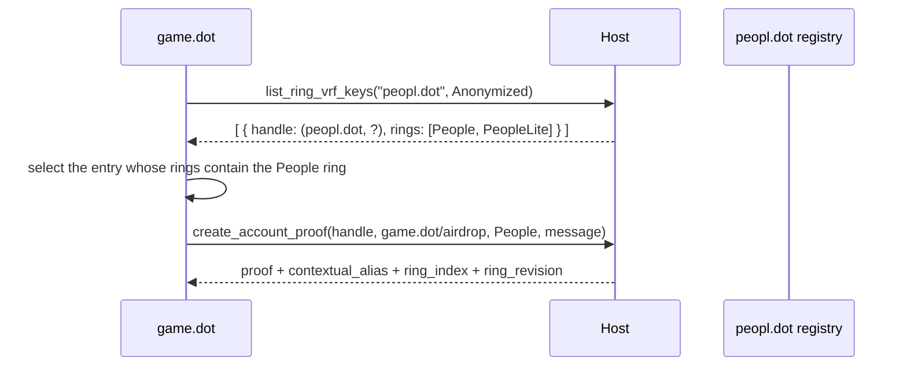

# RFC-0024: Proof of Personhood as a Product — Explicit Ring VRF Key Management

|                 |                                                                                                                    |
| --------------- | ------------------------------------------------------------------------------------------------------------------ |
| **RFC Number**  | 24                                                                                                                 |
| **Start Date**  | 2026-07-29                                                                                                         |
| **Description** | Make ring VRF member keys explicit, product-owned, and usable across products, so personhood can ship as a product |
| **Authors**     | Valentin Sergeev                                                                                                   |

## Summary

RFC-0004 makes the Host pick a ring VRF member key on the caller's behalf, with a hard-coded fallback to "the PoP ring". This RFC replaces that with **two separable changes**: an explicit `key_handle` parameter on `account_get_account_alias` and `account_create_account_proof`, deleting the selection contract; and a **registry** of `(handle, declared rings)` that the Host consults where no caller supplies a handle. A new `account_ring_vrf_sign` signs with the member key directly.

With an `onLoad` executable modality for global lifetime and the Accounts Protocol companions, personhood's **key management and client-side surface** move into a product whose key index no consumer — including the Host — has to know. Rings, membership, onboarding, and suspension remain on chain and are untouched by this RFC; "personhood as a product" means the client side of it, not the protocol.

A proof is a bearer token for its context's alias and a signature is a bearer token for the key, and neither can be constrained by inspecting an opaque message. Cross-product use of a foreign key is therefore gated on the owning product having allowlisted the caller in its manifest, with no user-prompt fallback — an interim position, with a more expressive scheme left to follow-up work. The RFC also resolves RFC-0022's deferral of well-known alias accounts: every context is product-owned and built with TrUAPI's product-scoped context function, so there is no second context scheme.

## Motivation

**Personhood is welded into the Host.** RFC-0004 §"Host member-key selection" requires every Host to define the PoP ring collection internally, choose a member key corresponding to the requested `RingLocation`, fall back to the PoP key when correspondence is undeterminable, and tiebreak stably. `truapi-server` implements exactly that with the ring identities compiled in (`rust/crates/truapi-server/src/runtime/signing_host/ring_vrf.rs`: `FULL_PERSON_COLLECTION`, `LITE_PERSON_COLLECTION`, `enum PersonKey { Full, Lite }`). So every change to how a person key is derived, registered, renewed, or recovered is a Host release.

A personhood product must instead own the full and light keys — under RFC-0022, the `peopl.dot` domain of the ring-VRF tree — while telling the Host and Account Holder enough to keep serving the app's own personhood-dependent features, and lending its keys and aliases to other products. The binding constraint across all of it: **no consumer may know which key is used**, not the app and not a calling product.

**The obstacle** is that the member keys serve three overlapping classes of work, and only one is not extractable:

| Class                        | Examples                                           | Extractable?                       |
| ---------------------------- | -------------------------------------------------- | ---------------------------------- |
| App-internal features        | coinage unload proofs, PGAS / Bulletin / SSS slots | No — the app itself needs the key  |
| Product-extractable features | game, mobrule, identity                            | Yes                                |
| Cross-product shared         | set identity account, set score alias              | Yes, but needs cross-product reach |

These motivate two changes with very different costs, and they are **separable** — either can be accepted without the other.

**The explicit key parameter is the cheap one, and it solves the motivating problem by itself.** Selection is fragile only because the key is missing from the request; once `key_handle` is present, alias determinism holds by construction rather than by cross-implementation agreement, and the selection contract can simply be deleted. No registry is required for that.

**The registry answers a different question**: when the Host performs coinage unloading, or the Account Holder assigns a ring-VRF allowance slot, there is no caller to supply a handle, so something must tell them which handle is the person key. That is the load-bearing justification. The other things a registry buys are weaker — cross-product discovery could be convention, since RFC-0022 already pins index 0 as full and index 1 as light, and phone-side bookkeeping is a nice-to-have. Against that, the registry adds distributed state, an intent leak, and the unenforceable derivation rule noted below.

Both are specified here because the app-internal flows need both, but a reviewer should be able to reject the registry without rejecting the parameter. The rejected alternative to the registry is in [Alternatives](#alternatives).

**Remote Hosts cannot reach ring VRF keys without the phone**, which is usually backgrounded. Two directions address it: the layered background-availability model designed for consent-free SSO requests (referenced, not respecified — see [Prior Art](#prior-art-and-references)), and an AutoSigning extension transferring the product's ring VRF domain entropy so the Host can derive registered member secrets locally.

## Stakeholders

- **Personhood product developers** — the first consumer; owns the registry entries for the full and light personhood rings.
- **Product developers building on personhood** — score / identity / mobrule / game; consume foreign handles, foreign contexts, and alias origins.
- **Host developers** — implement the registry, drop the compiled-in member-key selection, enforce the owner allowlist on proofs and signatures, add the `onLoad` modality.
- **Account Holder developers (Mobile App)** — become the authoritative registry, implement the new message pairs, extend the AutoSigning payload, answer registrations from the background.
- **Chain / individuality developers** — on-chain contexts must be derived with TrUAPI's product-scoped context function rather than a parallel namespace. `score`, `resources`, and `mob-rule` are named here as examples, **not as a complete list**: coinage has its own contexts, including ones constructed at runtime from a base plus period and counter, and there is a dotNS gateway context. Every such context has to be migrated to the product-scoped construction, and enumerating them is part of that work rather than of this RFC.

## Explanation

### Terminology

- **Ring VRF domain** — per RFC-0022, ring VRF keys live in their own tree rooted at `hash(root_entropy, "ring-vrf")`, with hard-only paths `//{productId}//{index}`. A product's _domain entropy_ is the node at `//{productId}`. This tree is disjoint from the sr25519 product-account tree at `//product//{productId}/{index}`.
- **DerivationIndex** — per RFC-0022, `Either<u32, [u8; 32]>`; each domain has its own index space.
- **Key handle** — the public name of a registered key: `ProductAccountId { dot_ns_identifier: <owner>, derivation_index: <index> }`. It names a slot in the owner's ring VRF domain, not an sr25519 account.
- **Registry** — the set of `(handle, declared rings)` entries. The Account Holder is authoritative; the Host holds a synchronized copy.

### Key management calls

Two additions to the `Account` trait, alongside the signing call in the next section.

Naming throughout this RFC: prose uses the **wire** method name, which is the service prefix plus the trait method — `account_create_account_proof`, `account_get_account_alias`, `account_ring_vrf_sign` — while the Rust snippets show the trait methods those wire names dispatch to (`create_account_proof`, `get_account_alias`, `ring_vrf_sign`). Sibling RFCs use the older `host_account_*` spelling for the same calls.

```rust
type RingVrfPublicKey = [u8; 32];

/// A registry entry as returned to a caller.
struct RegisteredRingVrfKey {
    /// Stable public name of the key.
    handle: ProductAccountId,
    /// Rings the owning product declared this key for.
    rings: Vec<RingLocation>,
    /// `Some` when the caller owns the key, or has been granted public-key disclosure.
    public_key: Option<RingVrfPublicKey>,
}

/// How much of a registry entry the caller is asking for.
enum RingVrfKeyDisclosure {
    /// Handle and declared rings only.
    Anonymized,
    /// Additionally the member public key.
    PublicKey,
}

/// Register a ring VRF key the calling product owns, declaring the ring it is
/// intended for. Registering the same `index` for an additional `ring` extends
/// the existing entry rather than creating a second one.
fn register_ring_vrf_key(
    index: DerivationIndex,
    ring: RingLocation,
) -> Result<RingVrfPublicKey, RegisterRingVrfKeyErr>;

/// List the registry entries owned by `owner` — the calling product or another one.
fn list_ring_vrf_keys(
    owner: ProductId,
    disclosure: RingVrfKeyDisclosure,
) -> Result<Vec<RegisteredRingVrfKey>, ListRingVrfKeysErr>;
```

- **A product may register only its own keys.** Ownership is the calling product id, never a parameter, so registration needs no capability gate and no prompt.
- **A key may be registered for many rings**, and a product may hold several keys for one ring. Nothing assumes 1:1.
- **Registration declares intent, not membership.** It means "this is the key I will use for that ring", not "the user is a person"; membership is still discovered only by attempting a proof, which returns `NotMember` (RFC-0004). This keeps the registry from being a personhood oracle.
- **The public key is owner-visible by default, permissioned cross-product**, because a member public key is linkable across every ring it appears in.

RFC-0022 already pins `//peopl.dot//index_bytes(0)` as the full personhood key and `index_bytes(1)` as the light one. Under this RFC those constants are the personhood product's own implementation detail, expressed to everyone else as two registry entries.

### Proofs, aliases, and signatures take an explicit key handle

RFC-0004's Host member-key selection contract is **deleted**: the Host no longer defines a PoP collection, infers correspondence, or has a fallback.

```rust
fn create_account_proof(
    key_handle: ProductAccountId,
    context: ProductProofContext,
    ring: RingLocation,
    message: Bytes,
) -> Result<HostAccountCreateProofResponse, HostAccountCreateProofError>;

fn get_account_alias(
    key_handle: ProductAccountId,
    context: ProductProofContext,
    ring: RingLocation,
) -> Result<HostAccountGetAliasResponse, HostAccountGetAliasError>;

/// Sign `message` with the member key itself, producing an ordinary signature
/// rather than an anonymous ring proof. Verified against the member public key,
/// so the signature is linkable and carries no ring or context.
fn ring_vrf_sign(
    key_handle: ProductAccountId,
    message: Bytes,
) -> Result<Bytes, RingVrfSignErr>;
```

`ring` stays a parameter on the first two even though the handle carries declared rings: a key may be registered for several, and the caller must say which the proof is against. The Host MUST verify `ring` appears in the handle's declared rings and return `KeyNotInRing` otherwise. RFC-0004's guarantee that `(key_handle, context, ring)` yields the same alias on every conforming Host now holds trivially, since key selection is no longer Host policy.

`account_ring_vrf_sign` takes neither: it derives no alias and proves no membership, so there is nothing for a context or a ring to scope. A verifier needs the member public key, which is what makes `RingVrfKeyDisclosure::PublicKey` load-bearing rather than merely informational, and which makes every such signature linkable to every other use of that key.

### Errors

```rust
enum RegisterRingVrfKeyErr {
    /// No user is signed in (RFC-0009).
    NotConnected,
    RingNotFound,
    Rejected,
    Unknown { reason: String },
}

enum ListRingVrfKeysErr {
    NotConnected,
    /// `owner` is not the calling product and the caller has no grant for it.
    Rejected,
    Unknown { reason: String },
}

// Extensions to the RFC-0004 error sets. `HostAccountGetAliasError` gains
// `KeyNotRegistered` and `KeyNotInRing`; only proofs carry the last variant.
enum HostAccountCreateProofError {
    RingNotFound,
    NotMember,
    /// `key_handle` has no registry entry.
    KeyNotRegistered,
    /// `key_handle` is registered, but not for the requested `ring`.
    KeyNotInRing,
    /// `key_handle` is foreign and its owner has not allowlisted the caller.
    NotAllowlisted,
    Rejected,
    Unknown { reason: String },
}

enum RingVrfSignErr {
    NotConnected,
    KeyNotRegistered,
    /// `key_handle` is foreign and its owner has not allowlisted the caller.
    NotAllowlisted,
    Rejected,
    Unknown { reason: String },
}
```

### Cross-product discovery

A game product producing a proof with the full personhood key, under its own airdrop context — abstracted by the product SDK, not the Host. It works because `peopl.dot` has allowlisted `game.dot`; see [Using a foreign key](#using-a-foreign-key-means-trusting-the-caller).



**Selection moves from on-chain state to declared intent, and that is a real change.** Today the Host derives both person keys and looks each up in the membership map, full before light, so full-versus-light is resolved against actual chain state. Here the consumer picks by the ring a key was _declared_ for and only learns it chose wrong when the proof returns `NotMember`.

No product needs "try full, fall back to light" today, so this RFC does not specify one. If a product ever does, the fallback belongs in the **product SDK**, not in the Host and not reimplemented per product — the Host no longer has the information to choose, and duplicating the retry across consumers is how the selection contract became fragile in the first place.

**No product should assume a key index of another product.** The index is the owner's implementation detail; consumers select by declared `RingLocation` and treat the handle as opaque. Hardcoding `(peopl.dot, 0)` breaks the moment the owner adds a key.

This is a **convention, not an enforceable rule**, and the RFC does not pretend otherwise. The index is part of the handle, so any caller that can list the registry can read it and hardcode it; `Anonymized` disclosure withholds the member public key, not the index. Hiding the index would mean the handle could no longer name a derivation slot, which is the whole point of it. So this lands as an implementation note for the **product SDK**, which should expose selection-by-ring and never surface a raw index to product code.

### Every context is owned by exactly one product

RFC-0004's `ProductProofContext { product_id, suffix }` and its derivation are unchanged:

```rust
fn product_context_bytes(ctx: ProductProofContext) -> [u8; 32] {
    blake2b256(utf8("product/") ++ utf8(ctx.product_id) ++ utf8("/") ++ ctx.suffix)
}
```

There is **no separate well-known-context namespace and no second context scheme.** Every context — including those existing as on-chain constants — is a `ProductProofContext` whose on-chain constant is the output of `product_context_bytes`, so RFC-0004's `product_account_id_for_proof_context(product_id, suffix)` applies unchanged and no context string needs encoding into a derivation suffix.

A context therefore has exactly one owner: the `product_id` mixed into its derivation. A context used by many products is not thereby owned by many — consumers name the owner's context, and only the owner can define one. Each context's alias account follows from the context alone, 1:1, through RFC-0004's `product_account_id_for_proof_context`.

**This supersedes RFC-0022 §"Well-known alias accounts"**, which describes `score`, `resources`, and `mob-rule` as owned by no product, outside the product-based construction, and defers their handling. Under this RFC they are ordinary product-owned contexts; **the score context is owned by the personhood product**, and DIMs coercible to the score system are its consumers. Access to a foreign context is governed by the permission model below; there is no sharing declaration on a context.

### Using a foreign key means trusting the caller

Both `account_create_account_proof` and `account_ring_vrf_sign` hand the caller output produced with someone else's member key, and neither can be constrained by inspection. **A proof is a bearer token for its context's alias, and a signature is a bearer token for the key itself.** `message` is opaque — for an extrinsic it is a hash of the inherited implication, and accepting a caller-supplied preimage would still be blind signing — so nothing at call time can tell what the result will authorize.

The concrete consequence, worth stating because it is not obvious: a product holding a proof for a context can build a `set_alias` binding that alias to an account of its own, sign it with its own product account, and submit it without involving the Host again. The alias then resolves to an account it controls. Every check passes; the proof was the authority. `account_ring_vrf_sign` is the wider version of the same problem, since it has no context or ring to scope what the signature is good for.

**This is not hypothetical, and it is not limited to the score context.** `pallet-alias-accounts` as already deployed in individuality takes the proof as a call argument, accepts **any** 32-byte context rather than an allowlisted set, works for both People and People Lite, and signs over `blake2_256(("alias-accounts", account, proof_valid_at))` — exactly the opaque hash described above. So every context reachable through that pallet is exposed, not one of them. The runtime should be adjusted so the contexts it accepts are aligned with TrUAPI's product-scoped derivation; until then the surface is wider than the alias flow below implies.

There is no way to bound this by structure at the call site. So it is bounded by **whom the owner trusts**:

> A Host MUST reject `account_create_account_proof` and `account_ring_vrf_sign` with a foreign `key_handle` unless the key's owning product has allowlisted the calling product in its manifest, with `NotAllowlisted`.

The allowlist is the _only_ authorization for these two calls. A user prompt is not a substitute and MUST NOT be offered as a fallback: consenting to an opaque message is not meaningful consent, and the risk being accepted is one only the key's owner is positioned to evaluate. This is a deliberate departure from the general permission model, where the allowlist merely avoids a prompt.

Foreign `account_get_account_alias` and foreign `account_get_account` are unaffected — reading an alias or an account id authorizes nothing — and `signing_create_transaction` is unchanged, keeping its `signer: ProductAccountId` and accepting a foreign one under an ordinary grant.

This is the pragmatic position, not the durable one. It makes cross-product key use an all-or-nothing trust decision by the owner, when what the owner actually wants to express is narrower — "you may prove personhood for your own airdrop" rather than "you may do anything my key can do". [Future work](#unresolved-questions) records the shape a general solution would take.

### The alias flow

Using an alias — claiming score rewards, say — is then:

1. **Read the alias.** `get_account_alias(pop_handle, score_context, people_ring)`. The consuming product checks the ring revision on each use and renews when it has moved; nothing else watches for it.
2. **Bind or rebind if needed.** Build a `set_alias` from the alias account id (`account_get_account` on the context's alias index, which the context determines 1:1) and a proof (`account_create_account_proof`, requiring the allowlist above). After a suspension this is a fresh `set_alias`; on a ring-revision change the accompanying action can ride an `AsPersonalAliasWithAccountRevised` origin alongside the update.
3. **Submit.** `signing_create_transaction` with the alias account's `ProductAccountId` as signer.

At worst three cross-product requests, and **in the happy path the user sees none of them** — the requirement that shapes the permission model below.

### The app's own personhood-dependent features

On a successful registration the Host matches the declared `RingLocation` against its well-known table (People, People-Lite) by structural equality, records the handle as the corresponding person key, and uses it wherever it used `PersonKey::Full` / `PersonKey::Lite` — coinage unload proofs on the Host, ring-VRF slot assignment for Bulletin / SSS allowance and PGAS claims on the Account Holder (RFC-0010). Both learn the mapping from the registry rather than a compiled-in product id or index, and the compiled-in ring table shrinks to a well-known-ring matcher used for feature routing, not key selection.

**Contention.** If two products register for the same well-known ring, the Host MUST NOT pick silently. It resolves to the product the user designated as their personhood provider — a Host setting defaulting to the first registrar and user-changeable — so a second product cannot silently displace the first.

### Product shape

The personhood product is not headless: it needs a **pocket card**, because personhood has user-facing state worth surfacing (recovery, suspension status, which products hold grants), and a **global lifetime**, to answer registration and cross-product requests regardless of what the user is looking at.

The existing manifest model fits — one executable manifest per modality, all sharing one globally-lived background script, with the enabled modalities determining the reachable TrUAPI surface. Today `worker` carries `includes: { chat, pocket }`. One addition:

```ts
interface WorkerIncludes {
  chat: boolean;
  pocket: boolean;
  /** Runs on host load with a global lifetime and contributes no UI surface. */
  onLoad: boolean;
}
```

The personhood product declares `{ pocket: true, onLoad: true }`. No capability flag gates the key-management calls: registration only touches the caller's own domain, and consuming a foreign key is governed by the permission model.

`onLoad` is independently useful for products that contribute no UI at all. Those run in the background and never show themselves, so the Host MUST disclose the fact at install time and list them in a user-reachable "runs in the background" inventory — a headless globally-lived executable is otherwise indistinguishable from a Host feature.

### Permission model

The calls this RFC touches fall into **two regimes with different rules**, and they must not be read as one. Everything that only ever _reads_ follows the ordinary model; the two calls that produce a bearer token do not.

**Regime A — reading. Ordinary RFC-0002 rules.**

| Call                                               | Own key        | Foreign                                                   |
| -------------------------------------------------- | -------------- | --------------------------------------------------------- |
| `account_register_ring_vrf_key`                    | permissionless | n/a — a product registers only its own keys               |
| `account_list_ring_vrf_keys` (either disclosure)   | permissionless | allowlist, else a one-time prompt                         |
| `account_get_account_alias`, `account_get_account` | permissionless | allowlist, else a one-time prompt                         |
| `signing_create_transaction`                       | permissionless | allowlist, else a one-time prompt — unchanged by this RFC |

Here the model is **user-approval driven**: an unapproved foreign access produces a one-time prompt with the persist-once lifecycle, and the owner's allowlist merely avoids that prompt. **Until the manifest RFC lands, these calls fall back to a one-time prompt per (caller, owner, call) triple**, persisted per RFC-0002.

**Regime B — producing a proof or a signature. Allowlist only.**

| Call                                                    | Own key        | Foreign                                    |
| ------------------------------------------------------- | -------------- | ------------------------------------------ |
| `account_create_account_proof`, `account_ring_vrf_sign` | permissionless | **owner's manifest allowlist, or refused** |

For these two the allowlist is not an optimization but the whole gate, per the rule above: a prompt is not a substitute and MUST NOT be offered, because consenting to an opaque message is not meaningful consent. **The interim fallback of the previous paragraph does not apply here** — the consequence is that foreign proofs and foreign signatures are simply **unavailable until the manifest RFC lands**, since there is nowhere yet to express the allowlist. Own-key use is unaffected and needs nothing.

The allowlist belongs to the product manifest, specified separately ([RFC: Product Manifest Format](https://github.com/paritytech/truapi/pull/206)), with two requirements from here: it must be **structurally extensible**, so a richer scheme (per-method grants, attestation thresholds) can replace a flat product-id list without a wire break; and it should be expressible **per method or category**, so "read my key handles" and "produce a proof with my key" need not be one grant.

### Accounts Protocol

Ring VRF secrets derive from the user's root entropy, so every operation here ultimately belongs to the Account Holder.

```rust
struct RegisterRingVrfKeyRequest {
    calling_product_id: ProductId,
    index: DerivationIndex,
    ring: RingLocation,
}
struct RegisterRingVrfKeyResponse {
    responding_to: SsoSessionRequestId,
    payload: Result<RingVrfPublicKey, RingVrfError>,
}

struct ListRingVrfKeysRequest {
    calling_product_id: ProductId,
    owner: ProductId,
    disclosure: RingVrfKeyDisclosure,
}
struct ListRingVrfKeysResponse {
    responding_to: SsoSessionRequestId,
    payload: Result<Vec<RegisteredRingVrfKey>, RingVrfError>,
}
```

A Host holding a current registry snapshot answers `list` locally. `RingVrfProofRequest` and `RingVrfAliasRequest` gain `key_handle: ProductAccountId` alongside the `calling_product_id` they already carry, and a `RingVrfSignRequest` / `Response` pair mirrors `account_ring_vrf_sign` with the same two fields plus `message`. `RingVrfError` gains `KeyNotRegistered`, `KeyNotInRing`, and `NotAllowlisted`.

**Registration always reaches the Account Holder, but never blocks on it.** The phone is the authoritative registry — it needs the complete set to serve slot assignment and PGAS claims, and to show the user what their keys are used for. A Host holding the product's domain entropy answers immediately and mirrors the registration fire-and-forget; registration is idempotent, so re-notifying the phone about an entry it already has costs nothing. Without the entropy the Host issues the request and waits.

> **A Host MUST NOT derive a member secret for a `(product, index)` pair absent from its registry.**

This needs saying because domain entropy makes derivation _unconditional_: given the entropy of `//peopl.dot`, a Host can compute the member secret at index 7, or 4711, or any other, since derivation is pure arithmetic and nothing about holding the entropy distinguishes a meaningful index from a meaningless one. The registry supplies that distinction. Serve an unregistered index and the phone has no record the key exists — it cannot include it in slot assignment, list it in the inventory, or answer "what is this key used for". So the entropy lets a Host **derive** a key the registry already lists; only registration, which always reaches the phone, brings one into **existence**.

#### Answering while the phone is backgrounded

Registration is consent-free from the user's point of view and not latency-critical, so it is served by the layered background-availability model already designed for consent-free SSO requests — handshake prefetch, foreground, a bounded hot window, a push-woken headless cold path, and a mandatory non-blocking degrade. That model is specified in its own document (see [Prior Art](#prior-art-and-references)) and is not restated here.

Two consequences belong to this RFC: prefetch should carry the registry snapshot, so a consumer of an already-registered key never pays a round trip; and every headless execution context has a system-enforced budget (~30 s, ~24 MB), which a `RingVrfPublicKey` derivation fits comfortably but a ring VRF **proof** may not — the second motivation for the extension below.

#### AutoSigning extension

RFC-0022 collapses RFC-0010's `AutoSigning` payload to the product-root secret key alone. It is extended to also transfer the ring VRF domain entropy:

```rust
AutoSigning {
    /// Secret key of `//product//{productId}`.
    product_root_private_key: Sr25519SecretKey,
    /// Entropy of the `//{productId}` node of the ring-VRF tree (RFC-0022).
    /// Lets the Host derive the member secret of any *registered* key locally.
    ring_vrf_domain_entropy: RingVrfEntropy,
}
```

## Drawbacks

- **Removing the fallback makes personhood installable, and therefore missing.** A user without the product installed has no people key at all, so coinage unload and PGAS allowance stop working until they install it. Intended, but a real regression in default capability.
- **Cross-product key use is an all-or-nothing trust decision.** An allowlisted product can do anything the owner's key can do — prove under any context, sign any message — when what an owner wants to express is narrower. The blind-signing risk is contained by whom the owner trusts rather than by what the caller can ask for, which is why this is explicitly an interim position.
- **Bundling ring VRF entropy into AutoSigning widens one grant.** "Sign transactions without prompting me" and "produce personhood proofs offline" become one decision, and the second is arguably the stronger. Accepted deliberately: two grants would mean two authorization surfaces for what the user experiences as one relationship.
- **The registry is new distributed state**, agreed between the registering product, the caching Host, and the owning Account Holder; a stale Host returns `KeyNotRegistered` for a key that exists. Idempotent registration and a single authority keep it diagnosable, but it replaces a compile-time constant.
- **Registration leaks intent.** An anonymized listing still says "`peopl.dot` has a key it intends for the People ring" — not proof of membership, but a consumer learns the user has attempted full personhood before any proof is requested. The one privacy cost accepted for cheap discovery.
- **The silent happy path depends on the manifest RFC**: until the allowlist exists, each cross-product call in the alias flow produces a one-time prompt.
- **The key handle overloads `ProductAccountId`**, which now names both an sr25519 product account and a ring VRF slot in a different tree at the same `(product, index)`.

## Alternatives

- **Per-flow host callbacks instead of a registration call** — a Host call per internal flow with a product-supplied handler. Rejected: a new bidirectional contract for every internal feature the Host ever adds, coupled release cycles, and it hands the product flows (slot-table bookkeeping, claim budgets) RFC-0010 put on the Account Holder.
- **Inspecting the `message`**, with or without a caller-supplied preimage. Unimplementable: for an extrinsic it is a hash of the inherited implication, and trusting a caller's preimage is still blind signing.
- **Moving cross-product alias use into `signing_create_transaction`**, by generalizing its signer to carry personhood-alias origins so the Host produces the proof while satisfying the signer and never hands one out, then checking the `set_alias` target it can now see. **Deferred, not rejected** — this is the direction a general solution takes, and it is the one worked out furthest. It was set aside for now because it only closes the cases whose call shape the Host can recognize: `set_alias` is one known call with one checkable argument, whereas `account_ring_vrf_sign` has no such structure, so the chokepoint would have to be rebuilt for every consequential call and could not cover raw signing at all. Shipping the allowlist first keeps the interim rule simple and uniform across both calls.
- **Constraining the alias target on chain**, so `set_alias` accepts only an account the runtime can derive from the proof's context. Attractive — it would remove the class rather than the instance — but the context-to-alias-account mapping is a client-side HD derivation the runtime cannot verify, and it removes the deliberately convenient case of pointing an alias at a real product account.
- **Attestation thresholds / trusted verifiers** instead of a product-id allowlist. Deferred rather than dismissed: the flat list is simpler, and the manifest RFC must keep the schema extensible.
- **A `ProofContext` enum with a `PoP(WellKnownContextSuffix)` variant.** Rejected: it forks context derivation and alias-account mapping in two — the situation RFC-0022 left open and this RFC closes.

## Prior Art and References

- [RFC-0004 — Redesign `account_create_account_proof`](0004-ringlocation-redesign.md) — `RingLocation`, `ProductProofContext`, the context derivation, and the member-key selection contract this RFC deletes. Its "Out of scope: explicit member-key management … left to a future RFC" is this RFC.
- **RFC-0022 — Account key derivations** ([PR #296](https://github.com/paritytech/truapi/pull/296)) — the ring-VRF tree, `Either<u32, [u8; 32]>` indices, the reserved `peopl.dot` identity, and the `AutoSigning` payload this RFC extends. Its deferral of well-known alias accounts is resolved here.
- **RFC-0023 — sr25519 VRF signing for product accounts** ([PR #301](https://github.com/paritytech/truapi/pull/301)) — the complementary non-member path, where this RFC's ring VRF path serves members.
- [RFC-0020 — `signing_create_transaction` and its AP mirror](0020-create-transaction.md) — the pattern of specifying a TrUAPI call together with its AP companion, followed here.
- [RFC-0010 — W3S Allowance Management](0010-allowance.md) — AutoSigning and the PGAS / Bulletin / SSS flows that consume the person key.
- [RFC-0002 — Permission Model](0002-permission-model.md) — the prompt-once lifecycle every cross-product grant reuses · [RFC-0009](0009-unauthenticated-product-access.md) — `NotConnected` semantics · [RFC: Product Manifest Format](https://github.com/paritytech/truapi/pull/206) — where the allowlist is specified.
- [_SSO background availability — common model_](https://hackmd.io/rBEBjBzLQdOHvzwJkfufIQ) — the layered availability ladder the `onLoad` and AutoSigning sections lean on.
- `rust/crates/truapi-server/src/runtime/signing_host/ring_vrf.rs` — the compiled-in selection this RFC removes.
- [Polkadot People Registry / Ring VRF](https://forum.polkadot.network/t/the-people-registry/12749) · [individuality#878](https://github.com/paritytech/individuality/pull/878) — alias-account assignment for derived product addresses.

## Unresolved Questions

No open questions remain on the design above. Four items are deliberately deferred to follow-up work:

- **Expressing cross-product key use more narrowly than an allowlist.** The interim rule trades precision for time: an owner can say _who_ may use its key but not _for what_. What an owner wants is closer to "you may prove personhood under your own airdrop context" than "you may do anything my key can do". The most developed candidate is in [Alternatives](#alternatives) — routing alias use through `signing_create_transaction` so the Host sees the call — and any general answer has to cover `account_ring_vrf_sign`, where there is no call to inspect.
- **Revocation** — already deferred by RFC-0010 and made more urgent by the entropy transfer, including retraction of a registry entry by its owner.
- **Key recovery.** Rotation is deliberately _not_ in scope, and the registry's ability to express it (register a new index, retire the old) should not be read as an intention to use it. A person's alias is derived from their member key, so rotating the key changes that person's alias in **every context at once** — not merely in-flight ones — which is destructive rather than merely unspecified. The original PoP design treats the Bandersnatch key as something a person never changes, and individuality already handles the cases that do arise with `migrate_included_key` / `migrate_onboarding_key` plus an offchain worker that cleans up stale aliases. What remains open is recovery, which is a different problem from rotation.
- **Provider competition** — once personhood is a product, more than one can exist; the provider-designation setting is only the minimal hook.
